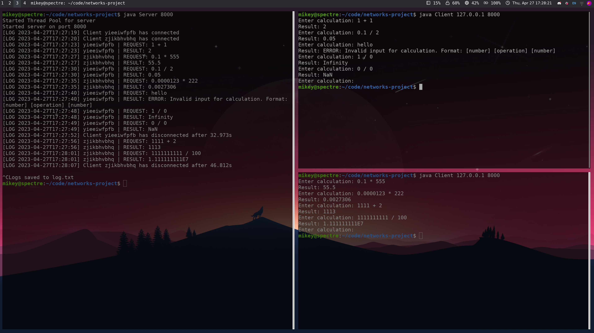
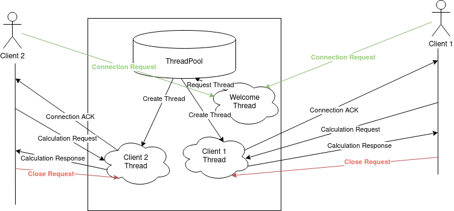

# Computer Networks Final Project

- Michael Zhao (myz200002)
- Ruben Mathew (rom190000)
- Parth Amrute (pxa190017)

## Protocol Design

Message formats:

```
Connection message format:
[CONNECTION_MESSAGE] [CLIENT_NAME] [NEWLINE]

Connection ACK message format:
[ACK_MESSAGE] [NEWLINE]

Connection ERR message format:
[ERR_MESSAGE] [NEWLINE]

Calculation message format:
[OPERAND1] [OPERATION] [OPERAND2] [NEWLINE]
eg. 1 + 2
eg. 1-2

Calculation result message format:
[RESULT] [NEWLINE]
eg. 3

Close message format:
[CLOSE_MESSAGE] [NEWLINE]
```

The client will send a **connection message** to the server. The server will respond with either a **connection ACK** or a **connection ERR**. If the server sends an ACK, the server will then start to listen for client messages. When the client sends a calculation message, the server will respond with a calculation result. When the client decides to end the connection, it sends over a **close message**, which will then tell the server to close the connection.

## Programming Environment

Using the wonderful Java JDK environment and JRE, we were able to program this program. To compile, we simply used the `javac` command line utility that was called through a Makefile.

## How to Compile and Execute (along with parameters)

To compile the code, simply run `make`.

To run the server, run `java Server <port>`, which will start the server and listen on the specified port.

To run the client, run `java Client <server address> <server port>`, which will start the client and attempt to connect to the server's address & port. If you are running the server locally, you can simply use **127.0.0.1** as the address.

## Challenges Faced

1. Network communication: Communication between the server and clients took a bit to set up due to the fact that we had to make our own message format. However, after that was defined it became pretty easy to use the protocol.
2. Handling multiple clients: Since we are dealing with multiple clients, we needed to ensure that the server can handle all the incoming requests efficiently. We ended up using Java's `java.util.concurrent` package's `ExecutorService` to handle multiple connections simultaneously.
3. Parsing math equations: Initially we thought of parsing complex equations but realized we could limit the calculations and just focus on the network part.
4. Error handling: When evaluating math equations, there may be errors such as division by zero, invalid syntax, or overflow/underflow. We needed to ensure that the program can handle such errors gracefully and provide appropriate feedback to the clients.

## What we have Learned

1. How to implement basic network programming in Java
2. Threading and concurrency through using thread pools
3. Makefiles and how to build larger Java projects using make
4. How to work together as a group :3

## Output Screenshot



## Design Doc


